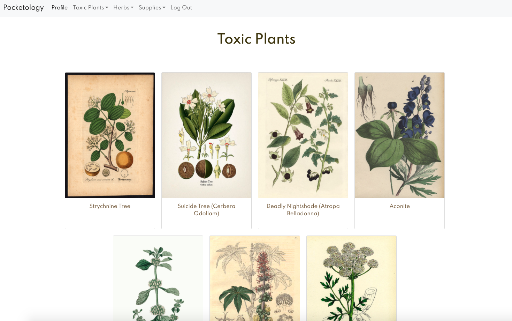
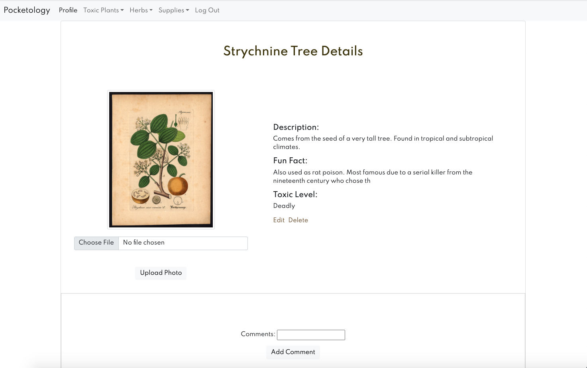
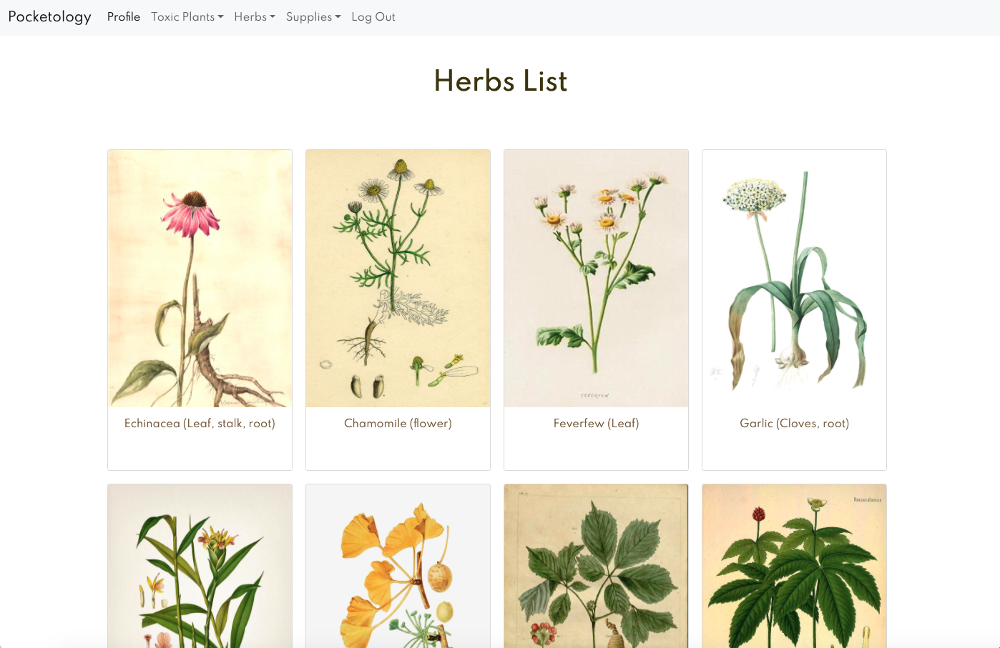

# Pocketology

Build your own personal apothecary cabinet with Pocketology! Create a collection of your favorite toxic plants, herbs, and supplies. Upload your own photos and watch as your cabinet grows! 

Heroku: 

Trello board: https://trello.com/b/D1I4otmu/pocket-botanical

## Screenshots

### Wireframes

### Toxic Plant Collection

### Toxic Plant Details

### Herb Colelction

## Technologies Used

- Whimsical
- Trello
- Python
- Django
- JavaScript
- HTML
- CSS
- GitHub
- Git
- Google Fonts
- Visual Studio Code
- Google Chrome DevTools 
- Bootstap4

## IceBox

- Plant API
- Save to personal collection

## Attributions

Disclaimer: All pictures are not my own, and credit goes to the artists of these drawings. 
- Pictures were found using [Google search](https://images.google.com/imghp?hl=en&gl=ar&gws_rd=ssl)
- Google Fonts [Google Fonts](https://fonts.google.com/specimen/Spartan?preview.text=Toxic%20plants&preview.text_type=custom&sidebar.open=true&selection.family=Eagle+Lake|Spartan:wght@200;300;400;500;600;700;800;900)
